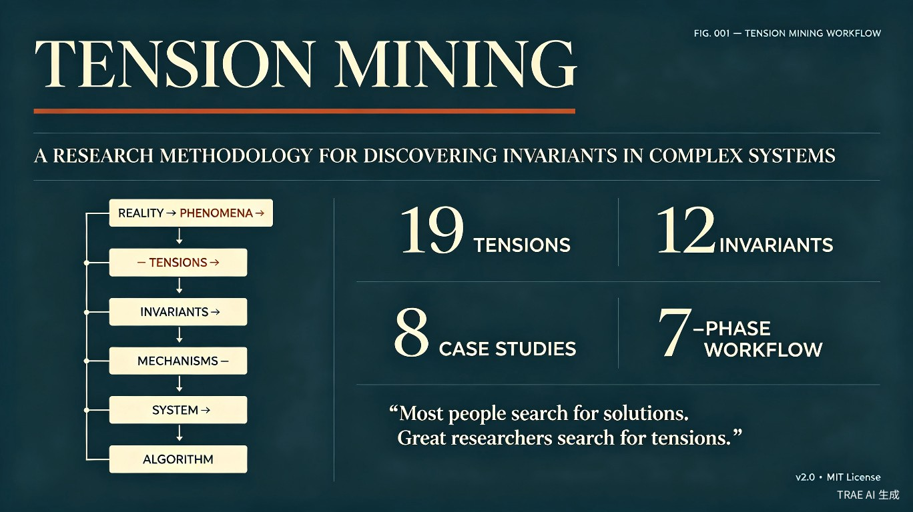

<p align="center">
  
  
</p>

<p align="center">
  <a href="https://github.com/zbbsdsb/Tension-Mining/stargazers"></a>
  <a href="https://github.com/zbbsdsb/Tension-Mining/network/members"></a>
  
  
  
  <a href="./examples/"></a>
  <a href="./templates/"></a>
  <a href="https://github.com/zbbsdsb/Tension-Mining/actions"></a>
</p>

<p align="center">
  <strong>
    ⭐ Star this repo &nbsp;·&nbsp;
    <a href="https://github.com/zbbsdsb/Tension-Mining/discussions">💬 Discussions</a> &nbsp;·&nbsp;
    <a href="https://twitter.com/intent/tweet?text=Tension%20Mining%20%E2%80%94%20Discover%20cross-domain%20invariants%20in%20complex%20systems&url=https://github.com/zbbsdsb/Tension-Mining">🐦 Share on Twitter</a>
  </strong>
</p>

---

<p align="center">
  English | <a href="./README.zh-CN.md">简体中文</a> | <a href="./README.es.md">Español</a> | <a href="./README.hi.md">हिन्दी</a>
</p>

---

> **Most people search for solutions. Great researchers search for tensions.**

A research methodology for discovering invariants hidden inside complex systems. Works as an **AI-executable Skill** across Claude Code, TRAE, Cursor, Windsurf, and any tool that supports Markdown-based skill files.

[Quick Start](#quick-start) · [How It Works](#how-it-works) · [Academic Foundations](#academic-foundations) · [Case Studies](#case-studies) · [Documentation](#documentation) · [References](#references) · [Contribute](./CONTRIBUTING.md)

---

## Table of Contents

- [Why Tension Mining?](#why-tension-mining)
- [Quick Start](#quick-start)
- [How It Works](#how-it-works)
- [The Seven Phases](#the-seven-phases)
- [Case Studies](#case-studies)
- [What This Is Not](#what-this-is-not)
- [Documentation](#documentation)
- [Roadmap](#roadmap)
- [License](#license)

---

## Why Tension Mining?

Most innovation workflows start too late.

They begin with algorithms, architectures, implementations, optimizations. But the most influential systems rarely emerge from optimization.

- **PageRank** began with a question about importance — not a matrix equation.
- **Bitcoin** began with a tension between decentralization and trust — not a blockchain data structure.
- **Wikipedia** began with a tension between openness and reliability — not a revision control system.
- **Transformer** began with a question about whether recurrence was necessary at all — not an attention mechanism.

The breakthrough appears long before the algorithm. It appears when a hidden tension is finally made visible.

**Tension Mining is a lens.** Its purpose is simple: help researchers discover the forces shaping a system before attempting to design the system itself.

### The Core Idea

Every persistent system is shaped by a set of unresolved tensions.

| Domain | Tension |
|--------|---------|
| Organization | Freedom ↔ Efficiency |
| Society | Order ↔ Innovation |
| AI Agents | Autonomy ↔ Control |
| NPC Worlds | Survival ↔ Exploration |
| Products | Simplicity ↔ Capability |
| Markets | Competition ↔ Cooperation |

Most people focus on behavior. Tension Mining focuses on the forces underneath behavior.

---

## Academic Foundations

Tension Mining draws on and synthesizes concepts from multiple established research traditions.

| Field | Key References | Relationship |
|-------|---------------|--------------|
| Complex Systems | Mitchell (2009) [1], Holland (1995) [2] | Core framework for emergence, self-organization, and adaptation |
| Design Thinking | Schön (1983) [3], Cross (2006) [4] | Phenomenon-first approach, problem reframing before solution |
| Systems Thinking | Meadows (2008) [5], Senge (1990) [6] | Feedback loops, leverage points, system structure analysis |
| Cynefin Framework | Snowden & Boone (2007) [7] | Distinguishing ordered vs complex problem domains |
| Research Methodology | Kuhn (1962) [8], Lakatos (1970) [9] | Paradigm shifts, research program structure, falsification |
| Evolutionary Theory | Dawkins (1976) [10], Boyd & Richerson (1985) [11] | Variation-selection-retention as invariant discovery engine |
| Network Science | Barabási & Albert (1999) [12], Watts & Strogatz (1998) [13] | Emergent properties from local interactions, small-world phenomena |

These foundations are not decorative. Each directly informs a specific phase of the pipeline:
- **Complex Systems** → Phase 1 (phenomena must cross domains, not reinforce domain myopia)
- **Design Thinking** → Phase 2-3 (tensions before solutions, reframing as core skill)
- **Systems Thinking** → Phase 4-5 (mechanisms interact through feedback, not linear causality)
- **Cynefin** → Phase 7 (destruction reveals whether the problem was in a complicated or complex domain)
- **Evolutionary Theory** → Phase 3 (invariants are selected by cross-domain survival, not designer intent)

See the [Methodology Primer](./references/methodology-primer.md) for a detailed comparison with related methodologies and a complete reading list.

---

## Quick Start

### 1. Install

Clone this repository into your AI tool's skill directory:

```bash
# Claude Code — project-level (recommended)
git clone https://github.com/zbbsdsb/Tension-Mining.git .claude/skills/tension-mining

# Claude Code — user-level (all projects)
git clone https://github.com/zbbsdsb/Tension-Mining.git ~/.claude/skills/tension-mining

# TRAE
git clone https://github.com/zbbsdsb/Tension-Mining.git .trae/skills/tension-mining

# Cursor / Windsurf / other
# Place the repo anywhere accessible. Reference SKILL.md in your project instructions.
```

### 2. Use

**Automatic trigger** — describe a complex system problem in natural language:

> "I want to design a decentralized identity system for a P2P marketplace."

The AI detects the trigger and activates Tension Mining automatically.

**Manual trigger** — invoke the skill directly:

| Tool | Command |
|------|---------|
| Claude Code | `/tension-mining` |
| TRAE | AI auto-activates based on SKILL.md description |
| Cursor / Windsurf | Reference `SKILL.md` in your `.cursorrules` or project instructions |

### 3. Follow the 7 Phases

The AI will guide you through 7 phases, asking one question at a time:

```
1. Phenomenon Mining  →  Collect 5-10 real-world examples from 3+ domains
2. Tension Mining      →  Identify 5+ ineliminable tradeoffs
3. Invariant Mining    →  Extract 3+ cross-domain principles
4. Mechanism Mining    →  Study how reality resolves these tensions
5. System Synthesis    →  Combine into a coherent model
6. Algorithm Synthesis →  Derive algorithms from mechanisms (only now)
7. Destruction Phase   →  Attack your own model
```

**Core principle:** Do not start from solutions. Start from reality.

### For Researchers

Tension Mining provides a structured framework for academic research and teaching:

- **Thesis work**: A ready-made methodology chapter framework for complex systems, HCI, or design research theses
- **Paper writing**: The 7-phase pipeline maps naturally to paper sections (Introduction → Related Work → Method → Analysis → Results → Discussion)
- **Teaching**: Use the [90-minute workshop module](./docs/workshop-module.md) for graduate seminars
- **Citation**: [Cite this repository](./CITATION.cff) in your publications
- **Collaboration**: [Contribute](./CONTRIBUTING.md) a case study or tension and earn co-authorship credit on the methodology paper

---

## How It Works

### Design Patterns

Tension Mining uses a **Pipeline + Inversion + Generator** hybrid pattern:

- **Pipeline** — 7 phases execute in strict order. Each phase has a gate condition; you cannot proceed until it is met.
- **Inversion** — The AI interviews you phase-by-phase, asking one question at a time. You drive the content; the AI enforces the methodology.
- **Generator** — Output follows a structured template with defined sections, ensuring completeness.

### Anti-Cheat Mechanisms

- **Common Rationalizations table** — counters AI's tendency to skip steps ("I already know the tensions, let's skip to the algorithm")
- **Red Flags** — observable behaviors that indicate the methodology is being violated
- **Quality Rubric** — 5-dimension self-evaluation (D1-D5, score 0-15) appended to every output

### Progressive Disclosure

`SKILL.md` is a concise activation skeleton (~80 lines). Detailed phase instructions, atlases, and templates are loaded on demand, keeping initial context minimal.

---

## The Seven Phases

### 1. Phenomenon Mining

> What systems already exhibit this behavior?

Observe reality before building abstractions. Build a phenomenon library from ant colonies, companies, cities, ecosystems, online communities, open source projects.

### 2. Tension Mining

> What tradeoff can never be completely eliminated?

Identify forces pulling the system in different directions. Build a tension map.

### 3. Invariant Mining

> What remains true regardless of domain?

Search for patterns that appear across unrelated systems. Extract invariants.

### 4. Mechanism Mining

> What mechanisms already exist in nature, society, or technology?

Study how reality resolves tensions. Build a mechanism library.

### 5. System Synthesis

> What is the smallest model that explains the system?

Combine tensions, invariants, and mechanisms into a coherent model. Identify which tensions are primary, which mechanisms are essential, and what failure modes exist.

### 6. Algorithm Synthesis

> If the mechanism is real, how should it be implemented?

Only now design algorithms. Allow them to emerge naturally from mechanisms.

### 7. Destruction Phase

> What assumptions fail? What edge cases break the system?

Attack the model. Assume it is wrong. Identify weak assumptions, missing tensions, and possible redesigns.

---

## Case Studies

Each case study walks through the full 7-phase pipeline:

| Case Study | Domain | Key Tensions | Key Invariants |
|-----------|--------|-------------|----------------|
| [PageRank](./examples/page-rank.md) | Information Retrieval | Local vs Global, Freedom vs Efficiency | Local Rules Create Global Order, Gradients Drive Movement |
| [Transformer](./examples/transformer.md) | Deep Learning | Synchronicity vs Asynchronicity, Compression vs Fidelity | Compression Reveals Structure, Gradients Drive Movement |
| [Bitcoin](./examples/bitcoin.md) | Cryptocurrency | Centralization vs Decentralization, Competition vs Cooperation | Identity Drives Cooperation, Tradeoffs Are Inescapable |
| [Git](./examples/git.md) | Version Control | Consistency vs Availability, Local vs Global | Local Rules Create Global Order, Identity Drives Cooperation |
| [Wikipedia](./examples/wikipedia.md) | Collaborative Knowledge | Freedom vs Efficiency, Individual vs Collective | Identity Drives Cooperation, Compression Reveals Structure |
| [NPC Society](./examples/npc-society.md) | Multi-Agent Systems | Survival vs Exploration, Individual vs Collective | Local Rules Create Global Order, Variation Enables Selection |
| [Agent Organization](./examples/agent-organization.md) | AI Coordination | Autonomy vs Control, Centralization vs Decentralization | Identity Drives Cooperation, Feedback Loops Stabilize |
| [Dialogue Walkthrough](./examples/dialogue-example.md) | Decentralized Identity | *Full 7-phase interaction demo* | *Recommended first read* |
| [Consensus Protocols](./examples/consensus-protocols.md) | Distributed Systems | Safety vs Liveness, Consistency vs Availability | Local Rules Create Global Order, Tradeoffs Are Inescapable |
| [Ant Colony Foraging](./examples/ant-colony.md) | Biological Systems | Individual vs Collective, Survival vs Exploration | Local Rules Create Global Order, Variation Enables Selection |
| [Market Efficiency](./examples/market-efficiency.md) | Economics | Order vs Innovation, Competition vs Cooperation | Preferential Attachment, Tradeoffs Are Inescapable |
---

## What This Is Not

- **Not** a prompt collection
- **Not** a brainstorming template
- **Not** a productivity framework
- **Not** a guaranteed path to innovation
- **Not** a visual design system

Tension Mining is a lens. Its purpose is simple: help researchers discover the forces shaping a system before attempting to design the system itself.

---

## Documentation

| Path | Purpose |
|------|---------|
| [`SKILL.md`](./SKILL.md) | Activation skeleton — the AI entry point (~80 lines) |
| [`references/execution-protocol.md`](./references/execution-protocol.md) | Detailed 7-phase instructions (Goal / Interview / Output / Gate) |
| [`references/interface-contract.md`](./references/interface-contract.md) | Input/output specification and error handling |
| [`references/quality-rubric.md`](./references/quality-rubric.md) | 5-dimension scoring rubric (D1-D5, 0-15 scale) |
| [`references/tension-atlas.md`](./references/tension-atlas.md) | Catalog of 19 persistent tensions across 5 domains |
| [`references/invariant-atlas.md`](./references/invariant-atlas.md) | Catalog of 12 cross-domain invariants across 4 layers |
| [`references/methodology-primer.md`](./references/methodology-primer.md) | Extended methodology reference & FAQ |
| [`examples/dialogue-example.md`](./examples/dialogue-example.md) | Full user-AI dialogue walkthrough (**recommended first read**) |
| [`examples/`](./examples/) | 10 additional case studies |
| [`templates/_core-template.md`](./templates/_core-template.md) | Shared 7-phase workflow skeleton |
| [`templates/`](./templates/) | 9 domain-specific templates (Algorithm, AI Agent, NPC Society, Organization, Protocol, API Design, Consensus Protocol, Game Design) |
| [`PROJECT_STRUCTURE.md`](./PROJECT_STRUCTURE.md) | Directory layout, dependency graph, governance rules |
| [`CONTRIBUTING.md`](./CONTRIBUTING.md) | How to contribute tensions, invariants, cases, and templates |
| [`CHANGELOG.md`](./CHANGELOG.md) | Version history |

---

## Roadmap

### v2.0 (Current)
- [x] 7-phase pipeline with gate conditions
- [x] Progressive Disclosure architecture
- [x] Atlas with [CORE]/[EXPERIMENTAL] labeling
- [x] 9 domain-specific templates
- [x] 8 case studies
- [x] Quality rubric (D1-D5)
- [x] CI/CD with automated atlas validation
- [x] Anti-Rationalization defense mechanisms

### v2.1 (Planned)
- [ ] Interactive web demo
- [x] Additional case studies (Distributed Systems, Biological Systems, Economics)
- [x] Template expansion (API Design, Consensus Protocols, Game Design)
- [ ] Community-contributed tensions and invariants
- [x] Multi-language support (Chinese, Spanish, Hindi)

---

## One Question

Before designing anything, ask:

> What tension am I actually looking at?

The answer is often more valuable than the algorithm.

---

## References

1. Mitchell, M. (2009). *Complexity: A Guided Tour*. Oxford University Press. ISBN: 978-0195124415
2. Holland, J. H. (1995). *Hidden Order: How Adaptation Builds Complexity*. Addison-Wesley. ISBN: 978-0201442931
3. Schön, D. A. (1983). *The Reflective Practitioner: How Professionals Think in Action*. Basic Books. ISBN: 978-0465068788
4. Cross, N. (2006). *Designerly Ways of Knowing*. Springer. ISBN: 978-1846283000
5. Meadows, D. H. (2008). *Thinking in Systems: A Primer*. Chelsea Green Publishing. ISBN: 978-1603580557
6. Senge, P. M. (1990). *The Fifth Discipline: The Art and Practice of the Learning Organization*. Doubleday. ISBN: 978-0385517256
7. Snowden, D. J. & Boone, M. E. (2007). "A Leader's Framework for Decision Making". *Harvard Business Review*, 85(11), 68–76.
8. Kuhn, T. S. (1962). *The Structure of Scientific Revolutions*. University of Chicago Press. ISBN: 978-0226458083
9. Lakatos, I. (1970). "Falsification and the Methodology of Scientific Research Programmes". In Lakatos, I. & Musgrave, A. (Eds.), *Criticism and the Growth of Knowledge*. Cambridge University Press. ISBN: 978-0521096232
10. Dawkins, R. (1976). *The Selfish Gene*. Oxford University Press. ISBN: 978-0199291151
11. Boyd, R. & Richerson, P. J. (1985). *Culture and the Evolutionary Process*. University of Chicago Press. ISBN: 978-0226069333
12. Barabási, A.-L. & Albert, R. (1999). "Emergence of Scaling in Random Networks". *Science*, 286(5439), 509–512. DOI: 10.1126/science.286.5439.509
13. Watts, D. J. & Strogatz, S. H. (1998). "Collective Dynamics of Small-World Networks". *Nature*, 393(6684), 440–442. DOI: 10.1038/30918

---

[](https://star-history.com/#zbbsdsb/Tension-Mining&Date)

## License

MIT License — Copyright (c) 2026 zbbsdsb

See [LICENSE](./LICENSE) for details.
