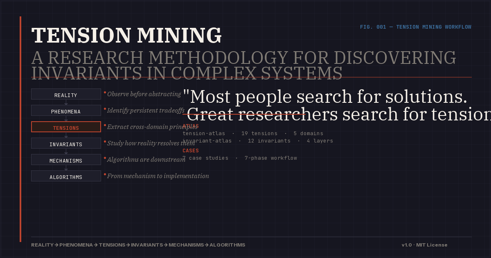

<p align="center">
  
</p>

<p align="center">
  <a href="./LICENSE"></a>
  <a href="./SKILL.md"></a>
  <a href="./references/tension-atlas.md"></a>
  <a href="./references/invariant-atlas.md"></a>
  <a href="./examples/"></a>
</p>

---

> Most people search for solutions. Great researchers search for tensions.

A research methodology for discovering invariants hidden inside complex systems.

---

## The Workflow

```
    REALITY
       |
       v
  +----------+
  |PHENOMENA |  <-- Observe before abstracting
  +----------+
       |
       v
  +----------+
  | TENSION  |  <-- Discover ineliminable tradeoffs
  +----------+
       |
       v
  +----------+
  |INVARIANT |  <-- Extract cross-domain principles
  +----------+
       |
       v
  +----------+
  |MECHANISM |  <-- Study how reality resolves them
  +----------+
       |
       v
  +----------+
  |  SYSTEM  |  <-- Synthesize into a coherent model
  +----------+
       |
       v
  +----------+
  |ALGORITHM |  <-- Algorithms are downstream, not start
  +----------+
       |
       v
  +----------+
  |DESTROY   |  <-- Attack your own model
  +----------+
```

---

## Why Tensions?

Most innovation workflows start too late.

They begin with algorithms, architectures, implementations, optimizations. But the most influential systems rarely emerge from optimization.

- **PageRank** began with a question about importance.
- **Bitcoin** began with a tension between decentralization and trust.
- **Wikipedia** began with a tension between openness and reliability.
- **Transformer** began with a question about whether recurrence was necessary at all.

The breakthrough often appears long before the algorithm. It appears when a hidden tension is finally made visible.

---

## Core Idea

Every persistent system is shaped by a set of unresolved tensions.

| Domain | Tension |
|--------|---------|
| Organization | Freedom ↔ Efficiency |
| Society | Order ↔ Innovation |
| AI Agents | Autonomy ↔ Control |
| NPC Worlds | Survival ↔ Exploration |
| Products | Simplicity ↔ Capability |
| Markets | Competition ↔ Cooperation |

Most people focus on behavior. Tension Mining focuses on the forces underneath behavior.

---

## The Seven Phases

### 1. Phenomenon Mining

> What systems already exhibit this behavior?

Observe reality before building abstractions. Build a phenomenon library from ant colonies, companies, cities, ecosystems, online communities, open source projects.

### 2. Tension Mining

> What tradeoff can never be completely eliminated?

Identify forces pulling the system in different directions. Build a tension map.

### 3. Invariant Mining

> What remains true regardless of domain?

Search for patterns that appear across unrelated systems. Extract invariants.

### 4. Mechanism Mining

> What mechanisms already exist in nature, society, or technology?

Study how reality resolves tensions. Build a mechanism library.

### 5. System Synthesis

> What is the smallest model that explains the system?

Combine tensions, invariants, and mechanisms into a coherent model. Identify which tensions are primary, which mechanisms are essential, and what failure modes exist.

### 6. Algorithm Synthesis

> If the mechanism is real, how should it be implemented?

Only now design algorithms. Allow them to emerge naturally from mechanisms.

### 7. Destruction Phase

> What assumptions fail? What edge cases break the system?

Attack the model. Assume it is wrong. Identify weak assumptions, missing tensions, and possible redesigns.

---

## What This Is Not

- **Not** a prompt collection
- **Not** a brainstorming template
- **Not** a productivity framework
- **Not** a guaranteed path to innovation
- **Not** a visual design system

Tension Mining is a lens. Its purpose is simple: help researchers discover the forces shaping a system before attempting to design the system itself.

---

## One Question

Before designing anything, ask:

> What tension am I actually looking at?

The answer is often more valuable than the algorithm.

---

## Repository Navigation

| Path | Purpose |
|------|---------|
| [`SKILL.md`](./SKILL.md) | AI-executable research protocol (7 phases) |
| [`references/tension-atlas.md`](./references/tension-atlas.md) | Catalog of persistent tensions across domains |
| [`references/invariant-atlas.md`](./references/invariant-atlas.md) | Cross-domain principles that remain valid |
| [`examples/`](./examples/) | 8 case studies: PageRank, Transformer, Bitcoin, Git, Wikipedia, NPC Society, Agent Organization, Dialogue Example |
| [`templates/`](./templates/) | 6 fill-in-the-blank templates for immediate use |
| [`references/`](./references/) | Execution protocol, interface contract, quality rubric, and methodology reference |

---

## License

MIT License - Copyright (c) 2026 CeaserZhao